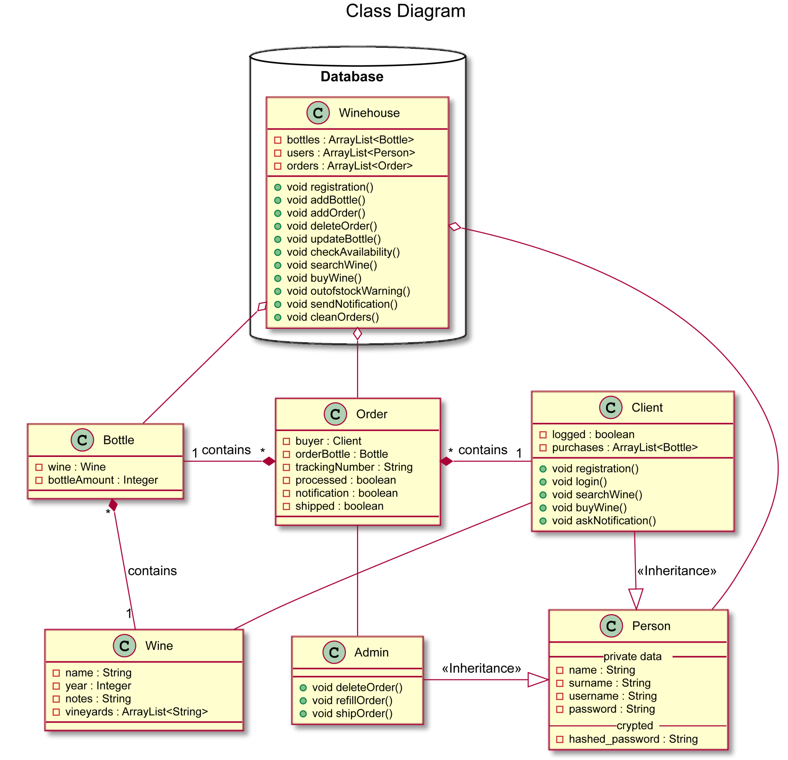
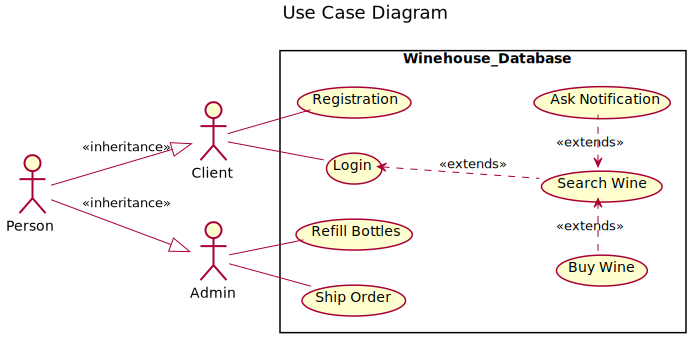

<!-- PROJECT LOGO -->
   
    

  
  <h1 align="center">Winehouse</h1>
  

    Java implementation of a software representing a wine store.
  

  

    Maven Project
  

  
  <!-- TABLE OF CONTENTS -->
  ## Table of Contents
  
  - [Table of Contents](#table-of-contents)
  - [About The Project](#about-the-project)
  - [UML](#uml)
    - [UML Class Diagram](#uml-class-diagram)
    - [UML Use-Case Diagram](#uml-usecase-diagram)
  - [Getting Started](#getting-started)
    - [Updates](#updates)
  - [License](#license)
  - [Contributors](#contributors)
   
   <!-- ABOUT THE PROJECT -->
   ## About The Project
   **Winehouse** simulates a wine store. 
   
   The system interacts with clients (who want to buy the wine) and employee (admins of the system who manage the selling).
   An user can sign into the Winehouse store, search wines by name and year of production and buy a specific number of bottles
   if logged in.
   
   Once a purchase is done, the operation is saved into the database (represented by the Winehouse Class) which provides to update
   the number of bottles on sale. If a bottle runs out of stock, the system notify the lack to the user, an admin must refill
   the bottles with a new amount and then update the new amount in the database.
   
   If an exact amount of bottles is not available, a client can subscribe for a notification. Once the number of bottles will be available, 
   the system will notify the availability to the user through a output message on console.
   
   The system runs a simple simulation divided by steps:
    
    1) The Winehouse is initialized with some users, an admin and some wines
    
    2a) User UX signs in and buy some of the bottle BX
    
    2b) User UY signs in and buy all the bottle BY
    
    3) User UZ signs to buy some of the bottle UY now gone out of stock, so ask to be notified when
    the bottle BY comes back available
    
    4) The employee refill the missing bottles UY and the system send a notification to the user UZ
    about the new availability of the bottle
    
   Some functions like: login, purchasing and shipping are time-simulated with a loading or a progress animation.
  
  <!-- UML DIAGRAMS  -->
   ## UML Class Diagram
   

    
   

   
   ## UML Use-Case Diagram
   

       
   

   
   <!-- GETTING STARTED -->
   ## Getting Started
   You can just clone this repository.
   
   ### Updates
   Pull this repository for updates.
   
   <!-- LICENSE -->
   ## LICENSE
   Distributed under the GPL License. See `LICENSE` for more information.
   
Icons made by <a href="https://www.flaticon.com/authors/smashicons" title="Smashicons">Smashicons</a> from <a href="https://www.flaticon.com/"title="Flaticon">www.flaticon.com</a>

   
   <!-- CONTRIBUTORS -->
   ## CONTRIBUTORS
   [Daniele Pellegrini](https://github.com/danielepelleg) - 285240
   
   [Riccardo Fava](https://github.com/BeleRicks11) - 287516