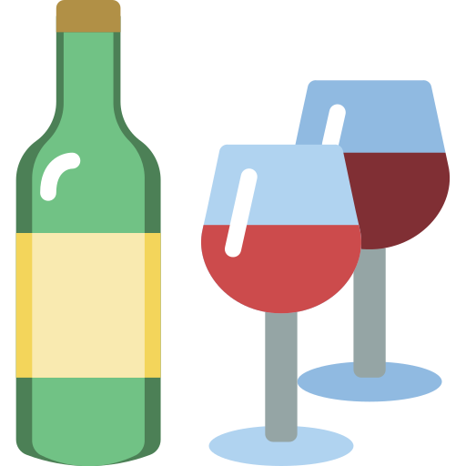
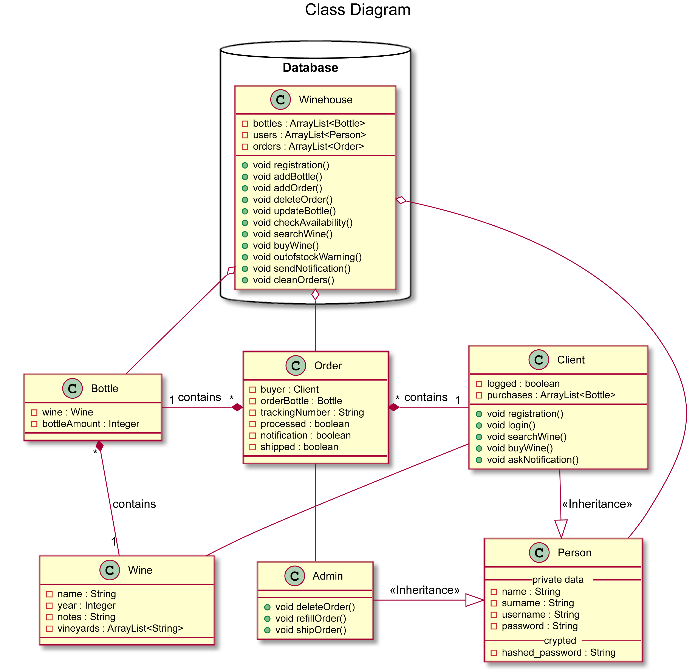
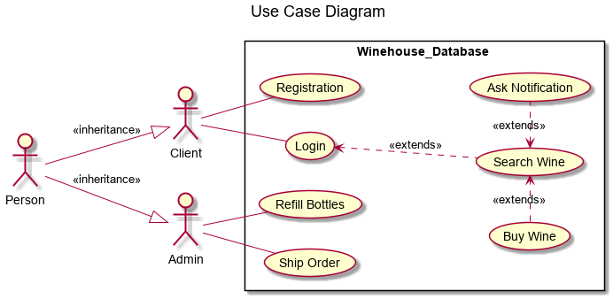

<!-- PROJECT LOGO -->
   
    

  
  <h1 align="center">Winehouse</h1>
  

    Java implementation of a software representing a wine store.
  

  

    Maven Project
  

  
  <!-- TABLE OF CONTENTS -->
  ## Table of Contents
  
  - [Table of Contents](#table-of-contents)
  - [About The Project](#about-the-project)
  - [UML Class Diagram](#uml-class-diagram)
  - [UML Use-Case Diagram](#uml-usecase-diagram)
  - [Getting Started](#getting-started)
  - [License](#license)
  - [Contributors](#contributors)
   
   <!-- ABOUT THE PROJECT -->
   ## About The Project
   
   <!-- UML CLASS DIAGRAM -->
   ## UML Class Diagram
   
   
   <!-- UML USE-CASE DIAGRAM -->
   ## UML Use-Case Diagram
   
   
   <!-- LICENSE -->
   ## LICENSE
   
Icons made by <a href="https://www.flaticon.com/authors/smashicons" title="Smashicons">Smashicons</a> from <a href="https://www.flaticon.com/"title="Flaticon">www.flaticon.com</a>

   
   <!-- CONTRIBUTORS -->
   ### Contributors
   [Daniele Pellegrini](https://github.com/danielepelleg) - 285240
   
   [Riccardo Fava](https://github.com/BeleRicks11) - 287516