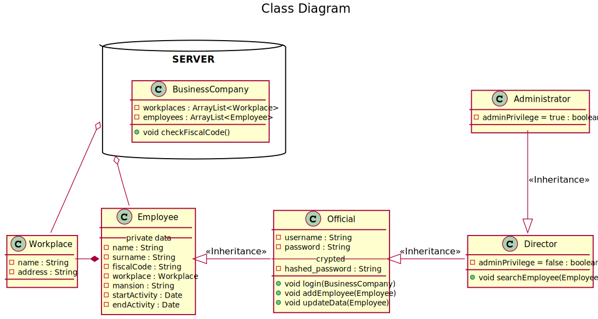
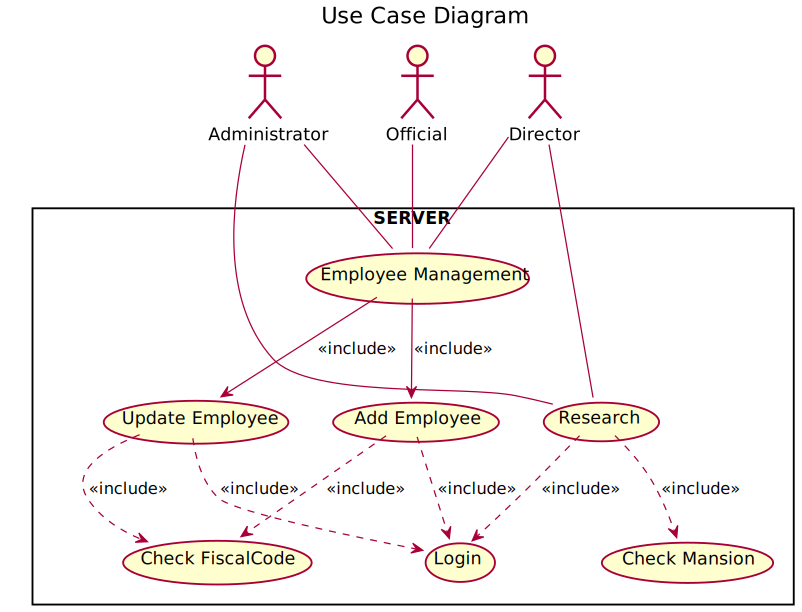

<!-- PROJECT LOGO -->
   
    

  
  <h1 align="center">Business Company</h1>
  

    Java implementation of a software representing a business company with different workplaces.
  

  

    Maven Project
  

  
  <!-- TABLE OF CONTENTS -->
  ## Table of Contents
  
  - [Table of Contents](#table-of-contents)
  - [About The Project](#about-the-project)
  - [UML Diagrams](#uml)
    - [Class Diagram](#class-diagram)
    - [Use-Case Diagram](#usecase-diagram)
  - [Getting Started](#getting-started)
    - [Updates](#updates)
  - [License](#license)
  - [Contributors](#contributors)
   
   <!-- ABOUT THE PROJECT -->
   ## About The Project
   **Business Company** simulates a a company with different workplaces. 
   
   The system is made up of a server, which has the task to keep the personal data and o ensure the research
   service, and more clients, who can add an edit the personal data among the different workplaces.
   
   The company includes a list of workplaces and employees. 
   
   Every workplace has a different name, as every user has a different fiscal code from the others.
   
   Officials can log in to the server and add new employees and update their personal data. The system provides to
   forbid the assignment of a fiscal code if a person with that same code already exists. In this case, it provides 
   to notify the error to the official.
   
   Directors can log in the server and do researches on all the employees, except of the administrators.
   
   Administrators can log in the server and do researches on all the employees.
   
   The system runs a simple simulation divided by steps:
    
    1) The Company is initialized with some workplaces, and personal data of some users. It's important
        that every workplaces has at least a official.
    
    2) Randomly, every official adds or updates some employees. The sequence of every action must be broken
        with a random timed wait. Once a new fiscal code is generated, it is compared to the already existing ones.
    
    3) Randomly, every director and administrator does a research on the list of employees of a workplace. 
        The sequence of every action must be broken with a random timed wait.
    
    4) The simulation test will be over after a random timed timer. This timer must ensure a right time to let 
        every actor does a right number of actions to test the system and to ensure a good concurrency management.
    
    5) The server will shut down the service when all the tests of the clients will be over and they will have 
        shut down the comunication with the server itself.
    
   
  <!-- UML DIAGRAMS  -->
   ## Class Diagram
   

    
   

   
   ## UseCase Diagram
   

       
   

   
   <!-- GETTING STARTED -->
   ## Getting Started
   You can just clone this repository.
   
   ### Updates
   Pull this repository for updates.
   
   <!-- LICENSE -->
   ## LICENSE
   Distributed under the GPL License. See `LICENSE` for more information.
   
Icons made by <a href="https://www.flaticon.com/authors/ddara" title="dDara">dDara</a> from <a href="https://www.flaticon.com/"title="Flaticon">www.flaticon.com</a>

   
   <!-- CONTRIBUTORS -->
   ## CONTRIBUTORS
   [Daniele Pellegrini](https://github.com/danielepelleg) - 285240
   
   [Riccardo Fava](https://github.com/BeleRicks11) - 287516