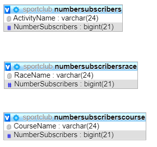
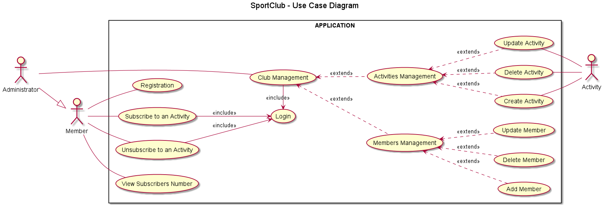
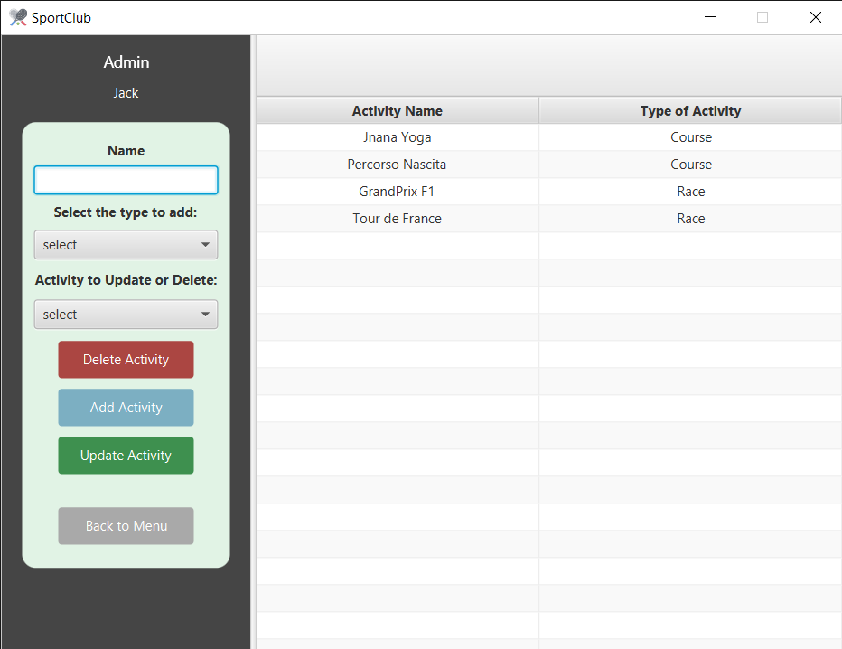

<!-- PROJECT LOGO -->
   
    

  
  <h1 align="center">Sport Club</h1>
  

    Java implementation of a JavaFX software representing a Sport Club with courses and races.
  

  

    Maven Project
  

  
  <!-- TABLE OF CONTENTS -->
  ## Table of Contents
  
  - [Table of Contents](#table-of-contents)
  - [About The Project](#about-the-project)
  - [Getting Started](#getting-started)
    - [pom.xml](#pomxml)
    - [Updates](#updates)
  - [Database](#database)
    - [Tables](#tables)
    - [Views](#views)
  - [UML Diagrams](#uml-diagrams)
    -[Use Case Diagram](#use-case)
  - [Screenshots](#screenshots)
  - [License](#license)
  - [Contributors](#contributors)
   
   <!-- ABOUT THE PROJECT -->
   ## About The Project
   **Sport CLub** simulates a club with different courses and races to subscribe to. 
   
   The system is made up of a MySQL Database (connection made using jdbc), which has the task to keep the personal data 
   of the members, the administrators, the course, the races and their subscriptions. A member can subscribe, 
   or unsubscribe to an activity. An administrator can do some management operations.
   
   Every change is stored on the database.
   
   Every member has a different username, and every course or race has a different name the others.
   
   A new member can register to the system by giving his personal data and choosing an username which must be not 
   already taken. The system provides to forbid the assignment of a username if a person with that same username already 
   exists. In this case, it provides to notify the error to the member. Once he signs in, he can subscribe or unsubscribe
   to activities and see the list of the race/course.
   
   Administrators can register themselves by inserting a username which must not to belong to others admins and log in 
   the system. They can see the list of the members registered to the club, the list of the courses and the races, the 
   list of subscriptions and can update every sort of data.
   
   The system has a GUI, that starts with the login/registration form.
    
    - You have to select if you want to sign in as a member or as administrator. Once you insert the right credentials
       the system will open your menu.
    
    - You can register yourself to the database by inserting an username, which as primary key of the table must be 
       different from anyone else. Your password will be stored hashed, once you complete the registration. From now
      you can login with your new credentials.
    
    - Once logged you will be redirected to your menu, where the buttons with the images will guide you to the 
       different operations you are allowed to perform. From this window you can also choose to disconnect, to come 
      back to the login/registration form.
   
   <!-- GETTING STARTED -->
   ## Getting Started
   You can just clone this repository and run the databaseCreation.sql in "src/main/java/Database/" to create the
   database. Before that, remember that the program requires JavaFX installed.
   
   ### Updates
   Pull this repository for updates.
   
   ### pom.xml
        <?xml version="1.0" encoding="UTF-8"?>
        <project xmlns="http://maven.apache.org/POM/4.0.0"
                 xmlns:xsi="http://www.w3.org/2001/XMLSchema-instance"
                 xsi:schemaLocation="http://maven.apache.org/POM/4.0.0 http://maven.apache.org/xsd/maven-4.0.0.xsd">
            <modelVersion>4.0.0</modelVersion>
        
            <groupId>it.unipr.fava_pellegrini</groupId>
            <artifactId>it.unipr.fava_pellegrini</artifactId>
            <version>1.0-SNAPSHOT</version>
            <dependencies>
                <dependency>
                    <groupId>mysql</groupId>
                    <artifactId>mysql-connector-java</artifactId>
                    <version>8.0.18</version>
                </dependency>
            </dependencies>
            <build>
                <resources>
                    <resource>
                        <filtering>false</filtering>
                        <directory>src/main/java</directory>
                        <includes>
                            <include>**/*.fxml</include>
                        </includes>
                    </resource>
                </resources>
            </build>
        </project>
        
   <!-- DATABASE -->
   ## DATABASE
   
   ### Tables
   

    
   

   
   ### Views
   

    
   

   
   <!-- UML DIAGRAMS  -->
   ## UML Diagrams
      
   ### Use Case
    
    
   <!-- SCREENSHOTS -->
   ## SCREENSHOTS
         
   
   
   
   
   
   
   
   
   
   <!-- LICENSE -->
   ## LICENSE
   Distributed under the GPL License. See `LICENSE` for more information.
   
Icons made by <a href="https://www.flaticon.com/authors/nikita-golubev" title="Nikita Golubev">Nikita Golubev</a> from <a href="https://www.flaticon.com/" title="Flaticon">www.flaticon.com</a>

   
Icons made by <a href="https://www.flaticon.com/authors/icongeek26" title="Icongeek26">Icongeek26</a> from <a href="https://www.flaticon.com/" title="Flaticon">www.flaticon.com</a>

   
Icons made by <a href="https://www.flaticon.com/authors/freepik" title="Freepik">Freepik</a> from <a href="https://www.flaticon.com/" title="Flaticon">www.flaticon.com</a>

   
Icons made by <a href="https://www.flaticon.com/authors/smashicons" title="Smashicons">Smashicons</a> from <a href="https://www.flaticon.com/" title="Flaticon">www.flaticon.com</a>

   
Icons made by <a href="https://www.flaticon.com/authors/freepik" title="Freepik">Freepik</a> from <a href="https://www.flaticon.com/" title="Flaticon">www.flaticon.com</a>

   
Icons made by <a href="https://www.flaticon.com/authors/smashicons" title="Smashicons">Smashicons</a> from <a href="https://www.flaticon.com/" title="Flaticon"> www.flaticon.com</a>

   
Icons made by <a href="https://www.flaticon.com/authors/mynamepong" title="mynamepong">mynamepong</a> from <a href="https://www.flaticon.com/" title="Flaticon"> www.flaticon.com</a>

   
   
   <!-- CONTRIBUTORS -->
   ## CONTRIBUTORS
   [Daniele Pellegrini](https://github.com/danielepelleg) - 285240
   
   [Riccardo Fava](https://github.com/BeleRicks11) - 287516
